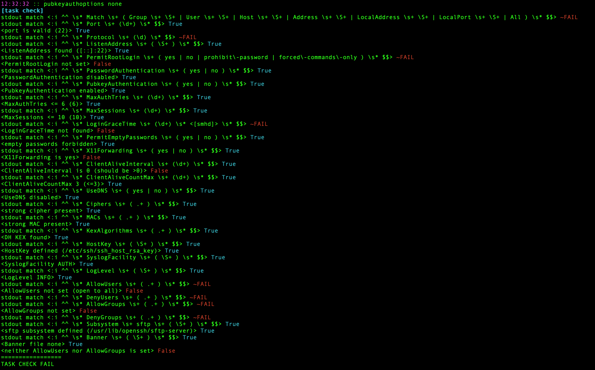

# scc

Compliance checks for Linux services and packages

# Install

```bash
s6 --install scc
```
# How to run

```bash
cat /etc/ssh/sshd_config | s6 --plg-run scc@check=sshd
sudo sshd -T | s6 --plg-run scc@check=sshd
sudo cat /etc/redis/redis.conf | s6 --plg-run scc@check=redis
sudo cat /etc/sudoers | s6 --plg-run scc@check=sudoers
```

# Parameters

## check

Check ID.

Available IDs

- sshd
- redis
- sudoers
- bind
- sysctl
- fstab

# Examples

You can see example configs to play with at
examples/ directory

# Report example

Sshd



# Author

Alexey Melezhik

